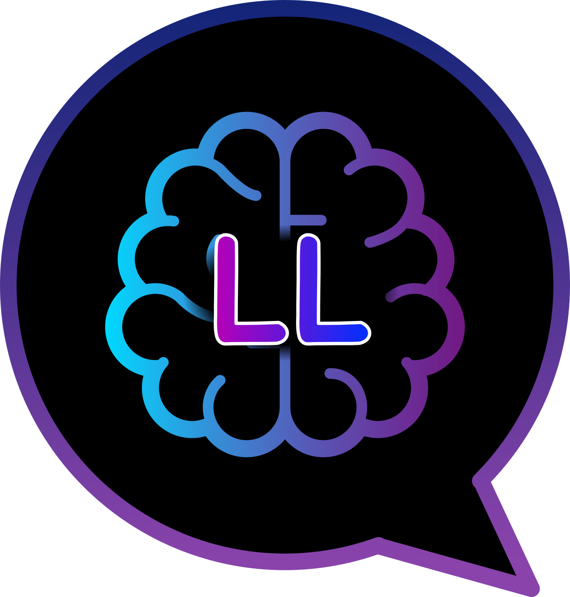
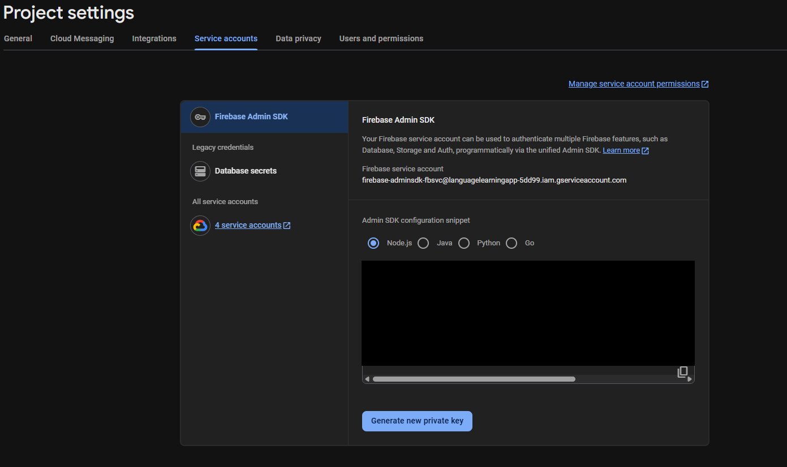
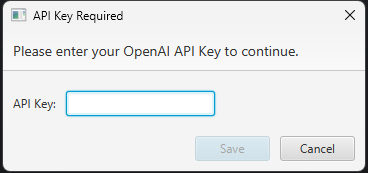

# LinguaLeap

> Your AI-powered partner for mastering new languages through dynamic, interactive conversation.

LinguaLeap is a desktop application built with JavaFX that revolutionizes language learning. Instead of static lessons, you engage in real-time conversations with an advanced AI, practice your speaking skills with guided tests, and track your progress in a fun, gamified environment.

<div style="text-align:center">

</div>

---

## Table of Contents

- [About The Project](#about-the-project)
- [Key Features](#key-features)
- [Getting Started](#getting-started)
    - [Prerequisites](#prerequisites)
    - [Installation & First-Time Setup](#installation--first-time-setup)
- [How It Works](#how-it-works)
- [Contributing](#contributing)
- [License](#license)

## About The Project

The goal of LinguaLeap is to make language acquisition more natural and effective by focusing on active use rather than passive memorization. By simulating real-world conversations and scenarios, the app helps you build confidence and fluency. The entire experience is customizable, from the interface language to the learning content itself, making it a powerful tool for learners of all levels.

## Key Features

-   🗣️ **Conversational Learning**: Have dynamic, open-ended conversations with an AI to practice your vocabulary, grammar, and flow.
-   🌐 **Fully Translatable Interface**: Set the application's UI to your preferred language for a more comfortable and accessible learning experience.
-   📝 **Guided Speaking Tests**: Receive a mini-lesson on a specific topic and then answer targeted questions to test your comprehension and speaking ability.
-   🏆 **Performance Evaluation & Gamification**: Get instant feedback on your conversations and test answers. Earn XP for every completed task to level up your language proficiency and stay motivated.
-   🛠️ **Create Your Own Content**: Don't just follow our lessons—build your own! Design custom conversations, create unique practice scenarios, and write your own speaking tests to focus on what matters most to you.
-   🔗 **Conversation Chains**: Link related conversations together to create extended, branching scenarios that mimic complex, real-life interactions.

## Getting Started

Follow these instructions to get a local copy up and running.

### Prerequisites

Before you begin, ensure you have the following installed:
*   **Java Development Kit (JDK)**: Version 17 or higher.
*   **Maven** (or Gradle): To build the project and manage dependencies.
*   An **OpenAI API Key**: LinguaLeap uses the OpenAI API to power its AI conversations. This is a mandatory requirement.

### Installation & First-Time Setup

1.  **Clone the repository**
    ```sh
    git clone https://github.com/Nielskepielske/Language_learning_app_public.git
    cd Language_learning_app_public
    ```

2.  **Prepare the Environment File**
    This project uses a `.env` file to store your secret API key. We've included a template for you.
    - In the root directory of the project, find the file named `.env.example`.
    - **Rename** or **copy** this file to `.env`.

    Your `.env` file should initially be empty or look like this:
    ```
    DB_MODE=OFFLINE
    ```
    **Important**: The application will automatically add your API key to this file later.

3.  **Build the Project**
    Open a terminal in the project root and run the Maven build command:
    ```sh
    mvn clean install
    ```

4.  **Run the Application**
    You can run the application from your favorite IDE (like IntelliJ or VS Code) by running the main class, or by using the command line.

---

### Optional: Enabling Online Synchronization with Firebase

LinguaLeap supports synchronizing your progress, custom conversations, and user profile across multiple devices. This feature is powered by Google Firebase. To enable it, you will need to set up a Firebase project and provide the application with a service account key.

**Follow these steps to enable online sync:**

**Step 1: Get Your Firebase Service Account Key**

1.  First, you must have a Google Firebase project. If you don't have one, create one for free at the [Firebase Console](https://console.firebase.google.com/).
2.  Inside your Firebase project, navigate to **Project Settings** by clicking the gear icon ⚙️ next to "Project Overview".
3.  Go to the **Service accounts** tab.
4.  Click the **Generate new private key** button. A warning will appear; click **Generate key** to confirm.

    
    *(A generic screenshot showing the Firebase UI for generating a key)*

5.  Your browser will download a JSON file with a long, unique name. **Rename this file to `serviceAccount.json`**.

**Step 2: Place the `serviceAccount.json` File**

1.  Take the `serviceAccount.json` file you just renamed.
2.  Place it in the **root directory** of the LinguaLeap project. This is the same directory that contains your `pom.xml` and `.env` files.

    Your project structure should look like this:
    ```
    LinguaLeap/
    ├── .env
    ├── serviceAccount.json   <-- Place the file here
    ├── pom.xml
    ├── src/
    └── ...
    ```

**Step 3: Configure Your `.env` File**

1.  Open your `.env` file.
2.  Add the `DB_MODE=ONLINE` variable. Your file should now look something like this:

    ```env
    OPENAI_API_KEY=sk-your-openai-api-key-goes-here
    DB_MODE=ONLINE
    ```
3.  Setting `DB_MODE` to `ONLINE` signals to LinguaLeap that it should initialize a connection to Firebase using the `serviceAccount.json` file upon startup.

**Important Security Note:** The `serviceAccount.json` file grants administrative access to your Firebase project. It is extremely sensitive. **Never** commit this file to a public repository. The project's `.gitignore` file should already be configured to ignore it, but it's good practice to double-check.

```gitignore
# Secret credentials
.env
serviceAccount.json
```

Now, the next time you run the application, it will synchronize your data with your online Firebase database instead of using the local database. If you ever want to switch back to offline mode, simply change `DB_MODE` to `OFFLINE` or remove the line entirely.

### **First-Time Setup: Adding Your OpenAI API Key**

When you run LinguaLeap for the very first time, it will detect that you haven't provided an API key and will prompt you to enter one.

**Step 1: Get Your OpenAI API Key**

1.  Go to the OpenAI API keys page: [**https://platform.openai.com/api-keys**](https://platform.openai.com/api-keys)
2.  You will need to sign up for an OpenAI account or log in if you already have one.
    *(Note: New users often receive free credits, which are perfect for getting started.)*
3.  Once logged in, click the "**Create new secret key**" button.
4.  Give your key a name (e.g., "LinguaLeap Key") and click "Create secret key".


5.  **Important:** OpenAI will only show you this key **ONCE**. Copy it immediately and store it somewhere safe.

**Step 2: Enter the Key into LinguaLeap**

1.  With the application running, you will see a dialog box asking for your API key.

    

2.  Paste the secret key you just copied from the OpenAI website into the input field.
3.  Click **Save**.

The application will now save your key securely into the `.env` file in your project directory. This file is included in `.gitignore`, so you will never accidentally commit your secret key to version control.

**That's it!** On all subsequent launches, LinguaLeap will automatically load the key from the `.env` file and the application will start directly, ready for you to begin your language journey.

## How It Works

LinguaLeap communicates with the OpenAI API by sending your conversational inputs and receiving AI-generated responses. The application logic then evaluates these interactions, calculates XP, and updates your user profile. All user-created content is stored locally, giving you full control over your learning materials.

## Contributing

Contributions are what make the open-source community such an amazing place to learn, inspire, and create. Any contributions you make are **greatly appreciated**.

Please refer to the project's issue tracker for areas where you can help.

## License

Distributed under the MIT License. See `LICENSE` for more information.